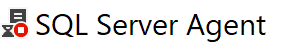

 [][sdfc] 

# Table of Contents

* [Instance](#instance)
  * [Database](#database)
    * [Database User](#database-user)
  * [Management](#management)
    * [Policy Management](#policy-management)
  * [SQL Server Agent](#sql-server-agent)
    * [Job](#job)
  * [Security](#security)
    * [Login](#login)
    * [Server Role](#server-role)
* [Why these samples](#why-these-samples)
* [Contribute](#contribute)

*Icons are from version 18 or greater.*

## Instance

Indicates the status of the SQL Server instance.

| Icon | Description |
| ---- | ----------- |
|  | SQL Server instance service state is running. |
|  | SQL Server instance service state is unknown and cannot be reached. |

## Database

Indicates the status of the database.

| Icon | Description |
| ---- | ----------- |
|  | Database state is normal. |
|  | Database state is offline. |
|  | Database state is restoring. |
|  | Database state is pending recovery. |
|  | Database state is suspect. |

### Database User

| Icon | Description |
| ---- | ----------- |
|  | Database user state is enabled - user granted connect privileges. |
|  | Database user state is disabled - user denied connect privileges. |

## Management

### Policy Management

Indicates the status of policy management.

| Icon | Description |
| ---- | ----------- |
|  | Policy Management state is enabled. |
|  | Policy Management state is disabled or unavailable in this edition. |

### Resource Governor

| Icon | Description |
| ---- | ----------- |
|  | Resource Governor state is enabled. |
|  | Resource Governor state is disabled. |

## SQL Server Agent

Indicates the status of the SQL Server Agent service.

| Icon | Description |
| ---- | ----------- |
|  | SQL Server Agent service state is running. |
|  | SQL Server Agent service is not running. |
|  | SQL Server Agent service state is unknown and cannot be reached. |

### Job

Indicates the status of the SQL Server Agent job.

| Icon | Description |
| ---- | ----------- |
|  | Job state is enabled. |
|  | Job state is disabled. |

## Security

### Login

Indicates the status of a login.

| Icon | Description |
| ---- | ----------- |
|  | Login state is enabled. |
|  | Login state is disabled. |

### Server Role

Indicates the modification status of a server role.

| Icon | Description |
| ---- | ----------- |
|  | Server role state is unlocked and can be modified. |
|  | Server role state is locked and cannot be modified. |

---

## Why These Samples

The samples chosen for this reference guide were done so as a part of [Sample Data for Change][samps], which strives
to leverage technical examples to increase awareness, diversification, and change within technical fields.

## Contribute

Missing something? Want to add an icon? Open an [issue][issue] to get some :heart:.

[issue]: https://github.com/LowlyDBA/ssms-icon-ref/issues
[samps]: https://lowlydba.github.io/sampledataforchange/
[sdfc]: https://sampledataforchange.github.io/
